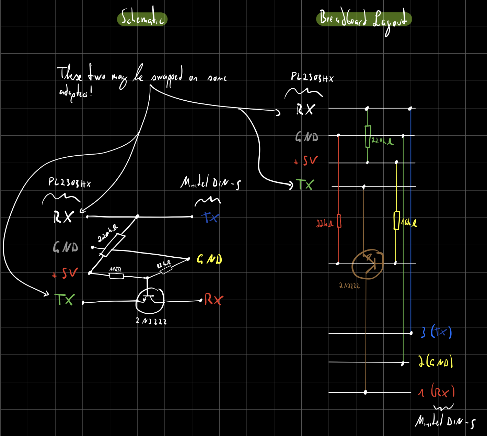
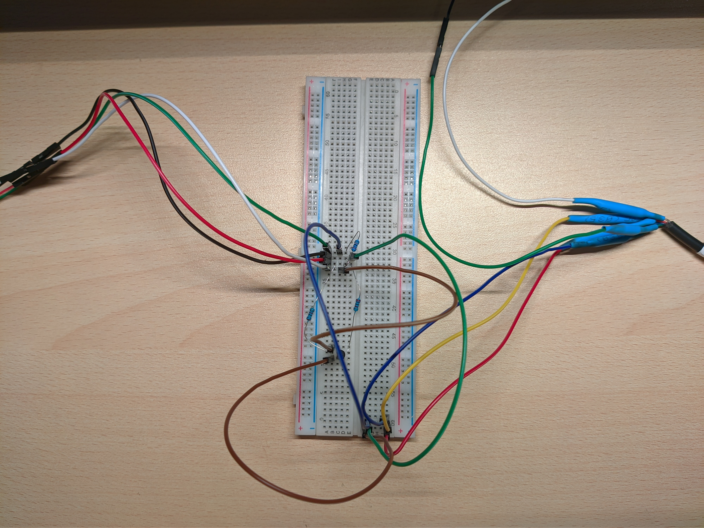
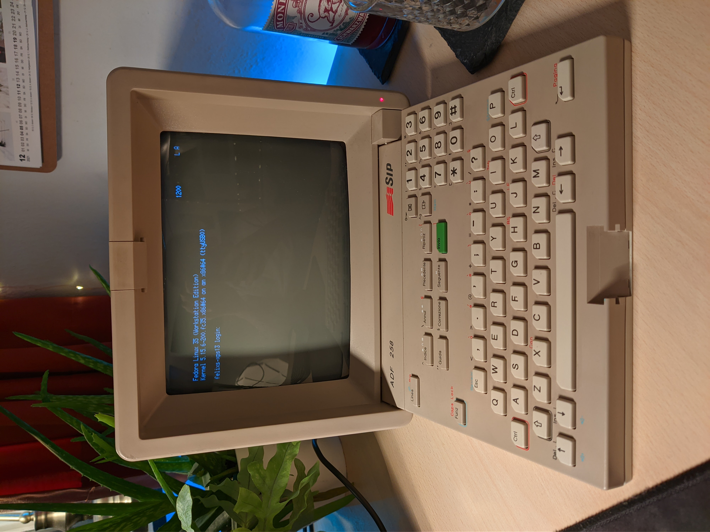
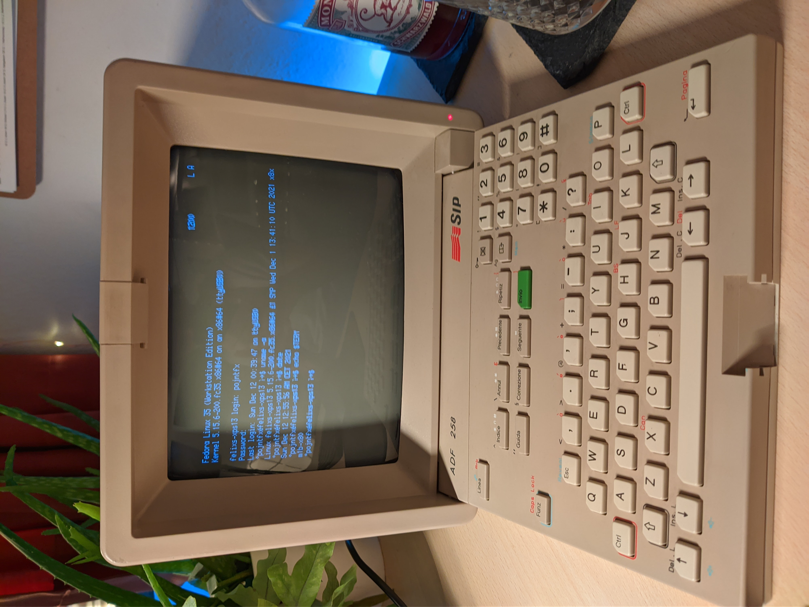
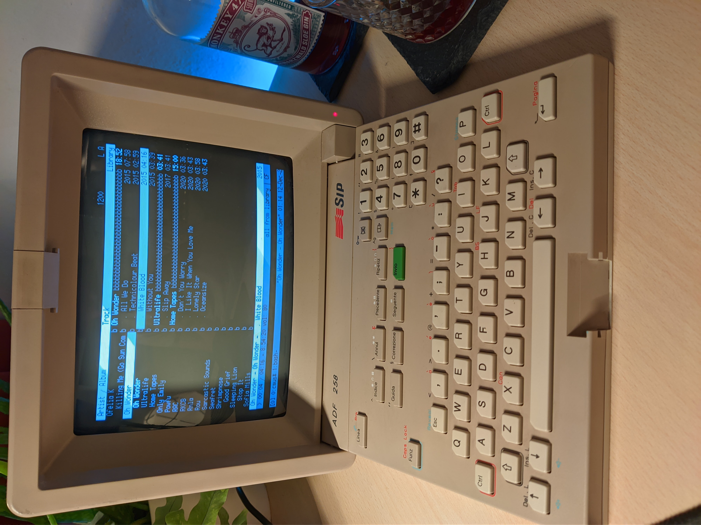

# Minitel

## Introduction

### Contributing

**Found an error or have a suggestion?** Please open an issue on GitHub ([github.com/pojntfx/minitel](https://github.com/pojntfx/minitel)):

{ width=150px }

### License

This document and included source code is Free Culture/Free Software.

{ width=128px }

Minitel (c) 2021 Felicitas Pojtinger

SPDX-License-Identifier: AGPL-3.0

\newpage

## Compatible Minitels

Your Minitel needs to have a <kbd>Funz</kbd> or <kbd>Fnct</kbd> key and the DIN-5 port at the back side. This includes the following Minitels:

- Minitel 1B
- Minitel 2
- Alcatel ADF 258

## Minitel DIN-5 to USB/RS232/Serial Adapter

To build the adapter to connect the Minitel to a PC, you need the following (cheap) components:

- 220 kΩ resistor
- 22 kΩ resistor
- 10 kΩ resistor
- 2N2222 transistor
- Male DIN-5 plug
- PL2303HX USB to UART TTL converter

You will need to check the pinout of the DIN-5 plug/cable; in my case, the following mapping is present:


Connect like so:



In my case, the breadboard prototype ended up looking like this:



I got this layout from [Pila's blog](https://pila.fr/wordpress/?p=361).

## Minitel Shortcuts

Minitel terminals show the integrated phonebook by default; for them to be usable serial terminals, use the following shortcuts:

**French Minitel 1B/2**:

1. <kbd>Fnct</kbd> + <kbd>T</kbd> <kbd>A</kbd>: Enables ASCII mode
2. <kbd>Fnct</kbd> + <kbd>T</kbd> <kbd>E</kbd>: Disables local echo
3. <kbd>Fnct</kbd> + <kbd>P</kbd> <kbd>4</kbd>: Sets baud rate to 4800 Baud (the maximum)

More info can be found on [Pila's blog](https://pila.fr/wordpress/?p=361).

**Italian Minitel (Alcatel ADF 258)**:

1. <kbd>Funz</kbd> + <kbd>Mem</kbd>: Switches to terminal mode
2. <kbd>Funz</kbd> + <kbd>M</kbd> <kbd>A</kbd>: Enables ASCII mode
3. <kbd>Funz</kbd> + <kbd>M</kbd> <kbd>E</kbd>: Disables local echo
4. <kbd>Funz</kbd> + <kbd>B</kbd> <kbd>4</kbd>: Sets baud rate to 4800 Baud (the maximum)

More info can be found on [Retronomicon](http://retrocomputing.c3po.it/Retronomicon/html/alcatel.htm).

## Testing the Adapter

First, plug the PL2303HX into a USB port on your PC, then run the following:

```shell
$ sudo stty -F /dev/ttyUSB0 4800 istrip cs7 parenb -parodd brkint ignpar icrnl ixon ixany opost onlcr cread hupcl isig icanon echo echoe echok
```

This will initialize the terminal. Now, set up the Minitel using the shortcuts, and try to display something on it:

```shell
$ echo 'Hello, Minitel!_' | sudo tee /dev/ttyUSB0
```

If the `_` did not print correctly, run the following and try again:

```shell
$ echo 'ǎ' | sudo tee /dev/ttyUSB0 # Fixes # and _ etc.
```

You may use [Minicom](https://en.wikipedia.org/wiki/Minicom) for further debugging: Start it using `sudo minicom -s -D /dev/ttyUSB0` and use 4800 Baud, 7 data bits, even parity bit, 1 stop bit and disable hardware flow control.

## Setting up the Keymap

[Alexandre Montaron](http://canal.chez.com/) has worked on improved support for the Minitel on Linux by providing a `terminfo` file; to get and use it, run the following:

```shell
$ curl -L -o /tmp/mntl.ti http://canal.chez.com/mntl.ti
$ tic /tmp/mntl.ti -o /etc/terminfo
```

You can also find a mirror [on GitHub Gist](https://gist.github.com/pojntfx/2ad486860b596f198ddd3749cb435bf1).

## Setting up agetty

Using [getty](<https://en.wikipedia.org/wiki/Getty_(Unix)>), or `agetty` in our case, it is possible to log into your PC using the Minitel. Exact setup instructions depend on your distribution, but for [Fedora 35](https://getfedora.org/) the following works; be sure to set up the Minitel using the shortcuts beforehand:

```shell
$ sudo tee /usr/lib/systemd/system/minitel-getty@.service <<'EOT'
#  SPDX-License-Identifier: LGPL-2.1-or-later
#
#  This file is part of systemd.
#
#  systemd is free software; you can redistribute it and/or modify it
#  under the terms of the GNU Lesser General Public License as published by
#  the Free Software Foundation; either version 2.1 of the License, or
#  (at your option) any later version.

[Unit]
Description=Getty on %I
Documentation=man:agetty(8) man:systemd-getty-generator(8)
Documentation=http://0pointer.de/blog/projects/serial-console.html
After=systemd-user-sessions.service plymouth-quit-wait.service getty-pre.target
After=rc-local.service

# If additional gettys are spawned during boot then we should make
# sure that this is synchronized before getty.target, even though
# getty.target didn't actually pull it in.
Before=getty.target
IgnoreOnIsolate=yes

# IgnoreOnIsolate causes issues with sulogin, if someone isolates
# rescue.target or starts rescue.service from multi-user.target or
# graphical.target.
Conflicts=rescue.service
Before=rescue.service

# On systems without virtual consoles, don't start any getty. Note
# that serial gettys are covered by serial-getty@.service, not this
# unit.
ConditionPathExists=/dev/%I

[Service]
# the VT is cleared by TTYVTDisallocate
# The '-o' option value tells agetty to replace 'login' arguments with an
# option to preserve environment (-p), followed by '--' for safety, and then
# the entered username.
ExecStart=/sbin/agetty -o '-p -- \\u' --noclear -c %I 4800 m1b-x80 $TERM
Type=idle
Restart=always
RestartSec=0
UtmpIdentifier=%I
TTYPath=/dev/%I
TTYReset=yes
TTYVHangup=yes
TTYVTDisallocate=yes
IgnoreSIGPIPE=no
SendSIGHUP=yes

# Unset locale for the console getty since the console has problems
# displaying some internationalized messages.
UnsetEnvironment=LANG LANGUAGE LC_CTYPE LC_NUMERIC LC_TIME LC_COLLATE LC_MONETARY LC_MESSAGES LC_PAPER LC_NAME LC_ADDRESS LC_TELEPHONE LC_MEASUREMENT LC_IDEN>

[Install]
WantedBy=getty.target
DefaultInstance=tty1
EOT
$ sudo systemctl daemon-reload
$ sudo systemctl enable --now minitel-getty@ttyUSB0
```

You should now get a login prompt (Note the `#` where there should be a `_`):



You can show the login prompt again at a later time using the following:

```shell
$ sudo systemctl restart minitel-getty@ttyUSB0
```

After logging in, you should get a fully-featured shell:



We'll fix the `#`/`_` characters next.

## Setting up `tmux`

`tmux` makes using the Minitel much more enjoyable by providing support for panes and much more. You can use it by running:

```shell
$ tmux
```

It should look like this:


To get started, I recommend taking a look at the [Tmux cheatsheet](https://tmuxcheatsheet.com/).

To fix the `#`/`_` characters and enable easy resetting when turning the Minitel on/off, run the following:

```shell
$ echo "bind-key r run-shell \"echo 'ǎ'; reset; echo 'Terminal has been reset, press q to close'\"" >>~/.tmux.conf
```

This will add a new command, <kbd>Ctrl</kbd> + <kbd>b</kbd> <kbd>r</kbd>, which will reset the terminal and fix the character set:


This now allows running complex software, like Vim, Links, Lynx and `cmus`:



