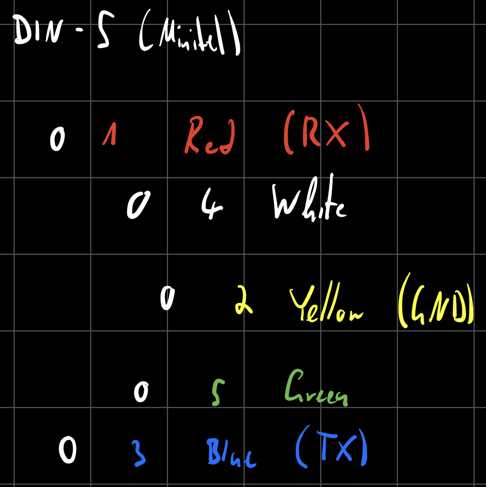

# Minitel

## Introduction

### Contributing

**Found an error or have a suggestion?** Please open an issue on GitHub ([github.com/pojntfx/minitel](https://github.com/pojntfx/minitel)):

{ width=150px }

### License

This document and included source code is Free Culture/Free Software.

{ width=128px }

Minitel (c) 2021 Felicitas Pojtinger

SPDX-License-Identifier: AGPL-3.0

\newpage

## Compatible Minitels

Your Minitel needs to have a <kbd>Funz</kbd> or <kbd>Fnct</kbd> key and the DIN-5 port at the back side. This includes the following Minitels:

- Minitel 1B
- Minitel 2
- Alcatel ADF 258

## Minitel DIN-5 to USB/RS232/Serial Adapter

To build the adapter to connect the Minitel to a PC, you need the following (cheap) components:

- 220 kΩ resistor
- 22 kΩ resistor
- 10 kΩ resistor
- 2N2222 transistor
- Male DIN-5 plug
- PL2303HX USB to UART TTL converter

You will need to check the pinout of the DIN-5 plug/cable; in my case, the following mapping is present:



Connect like so:


In my case, the breadboard prototype ended up looking like this:


I got this layout from [Pila's blog](https://pila.fr/wordpress/?p=361).

## Minitel Shortcuts

Minitel terminals show the integrated phonebook by default; for them to be usable serial terminals, use the following shortcuts:

**French Minitel 1B/2**:

1. <kbd>Fnct</kbd> + <kbd>T</kbd> <kbd>A</kbd>: Enables ASCII mode
2. <kbd>Fnct</kbd> + <kbd>T</kbd> <kbd>E</kbd>: Disables local echo
3. <kbd>Fnct</kbd> + <kbd>P</kbd> <kbd>4</kbd>: Sets baud rate to 4800 Baud (the maximum)

More info can be found on [Pila's blog](https://pila.fr/wordpress/?p=361).

**Italian Minitel (Alcatel ADF 258)**:

1. <kbd>Funz</kbd> + <kbd>Mem</kbd>: Switches to terminal mode
2. <kbd>Funz</kbd> + <kbd>M</kbd> <kbd>A</kbd>: Enables ASCII mode
3. <kbd>Funz</kbd> + <kbd>M</kbd> <kbd>E</kbd>: Disables local echo
4. <kbd>Funz</kbd> + <kbd>B</kbd> <kbd>4</kbd>: Sets baud rate to 4800 Baud (the maximum)

More info can be found on [Retronomicon](http://retrocomputing.c3po.it/Retronomicon/html/alcatel.htm).

## Testing the Adapter

First, plug the PL2303HX into a USB port on your PC, then run the following:

```shell
$ sudo stty -F /dev/ttyUSB0 4800 istrip cs7 parenb -parodd brkint ignpar icrnl ixon ixany opost onlcr cread hupcl isig icanon echo echoe echok
```

This will initialize the terminal. Now, set up the Minitel using [the shortcuts](#minitel-shortcuts), and try to display something on it:

```shell
echo 'Hello, Minitel!_' | sudo tee /dev/ttyUSB0
```

If the `_` did not print correctly, run the following and try again:

```shell
echo 'ǎ' | sudo tee /dev/ttyUSB0 # Fixes # and _ etc.
```

You may use [Minicom](https://en.wikipedia.org/wiki/Minicom) for further debugging: Start it using `sudo minicom -s -D /dev/ttyUSB0` and use 4800 Baud, 7 data bits, even parity bit, 1 stop bit and disable hardware flow control.
